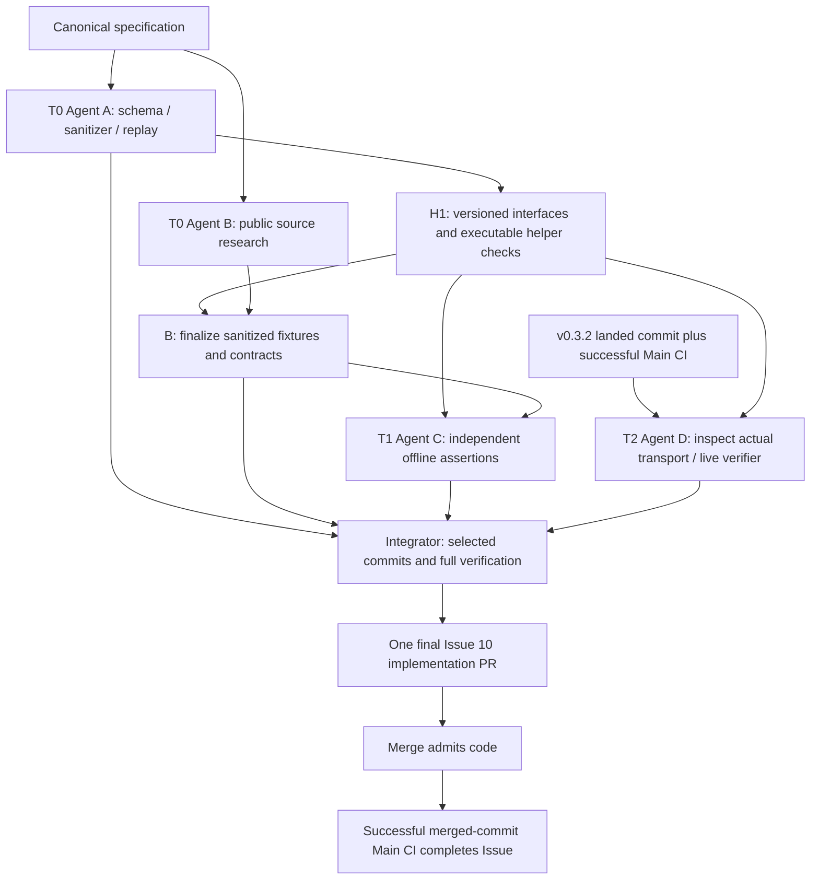

# Issue #10 — 并行执行计划

本计划派生自 [canonical spec](../specs/issue-10-nature-corpus.md)，冲突以规范为准，不能代替 PRD/EDD。该规划提交不实现 corpus，不完成 Issue。各执行者先读规范；修改规范须人工明确授权。

## 依赖与启动

A/B 可立即独立研究及实现各自任务；B 在 A schema 稳定前只研究公开来源/临时外部 captures，不冻结 manifest。C 在 H1 后可以先编写 assertion framework，不必等全部 fixtures，但最终 source-specific tests 等 B contract。D 的 transport 工作必须有 landed SHA 与对应成功 Main CI；2026-10-02 已见 v0.3.2 main `b489e381620c44b4b3c9e520deca99e154d39f77` 与 [CI](https://github.com/uwougil/Academic-clipper/actions/runs/37035169455)，启动时重新验证。D 同时消费 A replay interface。

各角色在独立 codex/ branches/worktrees 工作，仅产生供 integrator 选择的 commits，不各自建立/合并承担 Issue #10 部分责任的 ordinary PR。以最新 accepted main 为基线；禁止改变其他 agent checkout、index、branch 或 release/security worktree。不要混入 PR #13 commits。

## 角色与所有权

以下是未来实现的 preferred files，并非当前规划提交的修改授权。

| 角色 / goal | 所有权 | 边界 |
| --- | --- | --- |
| [A infrastructure](../goals/issue-10/agent-a-corpus-infrastructure.md) | test/corpus/corpus-schema.json；scripts/sanitize-nature-corpus.mjs；scripts/lib/nature-corpus-infrastructure.mjs；test/nature-corpus-infrastructure.test.mjs | 不拥有大批真实 fixtures；不改 parser/transport |
| [B acquisition](../goals/issue-10/agent-b-fixture-acquisition.md) | test/corpus/corpus-manifest.json；test/corpus/fixtures/**；docs/nature-corpus.md 的来源/coverage 部分 | 只实际来源与 excerpt contracts，不改 tests 来匹配 output |
| [C offline](../goals/issue-10/agent-c-offline-regression.md) | test/nature-corpus.test.mjs；test/golden-paper.test.mjs；scripts/lib/nature-corpus-assertions.mjs | 独立审核 B oracle，不私自改 fixtures/manifest |
| [D transport/live](../goals/issue-10/agent-d-live-verifier.md) | scripts/verify-nature-corpus-live.mjs；test/nature-corpus-live.test.mjs；src/clip.mjs 最小透传 seam（如需要） | 检查真实 transport；不改安全系统/依赖或第二套 parser |
| [Integrator](../goals/issue-10/integrator.md) | package.json 的 corpus scripts；README.md；最终 docs/nature-corpus.md 运行说明；必要 .gitignore report 条目 | 接纳 commits、协调接口、验收与单一 PR，尽量不写 feature logic |

共享边界通过只读 handoff 协调：A schema/replay → B/C/D；B manifest/fixture hashes → C；C comparison/assertion API → D；D transport seam → C integration。src/adapters/nature.mjs 只有确需 compatible seam 时由 D 提案并与 integrator 协调，不能额外 parser fix。不让多个 agent 同时编辑 package.json、README、schema、manifest 或同一 helper；文件重命名/API 变化由 owner 提供 commits 和迁移说明。

## H1 接口交接

A 必须提供 schema version、required/optional fields、hash byte 定义、retained-block recipe/serializer、resource declaration format；helper exports 的实际签名、成功/错误返回值、最小 synthetic 使用示例、request/DNS ledger 的检查方式以及通过的 focused tests。B/C/D 接受该版本并记录 SHA 后使用。若接口需要变更，由 A 做兼容修订并通知消费者；不得靠 chat 中未落盘的隐式约定。

B 每条 handoff 提供 admitted/rejected 状态、distinct structure、public source evidence、hashes/transformations/omissions、期望值的来源位置、replay resources、warnings、疑似 defect。C 独立核验 source 与 oracle，不能只看 parser output。D 提供 landed-main/CI evidence、transport API 审计、最小 diff、所有分类/exit-code mocked cases。Integrator 对实际 selected SHA 重新跑验证。

## 缺陷与规范问题

Parser defect：冻结受影响 assumption，保留最小真实 repro、正确期望、实际行为/命令、影响的 coverage role，提交独立 bug Work Contract 提案；按既有授权流程立项，不静默扩大实现。继续未受影响工作。不能篡改科学输入、删除困难结构或以 known failure 宣称覆盖完成。必需覆盖受阻时，Integrator 等独立 bug 完成，或者请求人工修订规范；不能自降验收。

规范错误/缺失：handoff 记录 clause、证据、推荐改动与消费者影响；canonical 文件保持不变，除非人工明确授权。候选替换在 spec admission gate 内不是规范变更；改变 publisher、dialect、真实性或安全边界则是。

## 统一 handoff

每个 agent 在其最后 commit/最终 handoff 中列出：base SHA、branch/worktree、ordered commit SHAs、owned changed files、spec clauses/覆盖角色、接口版本与用法、source/expectation evidence、exact commands 与 exit/results、known warnings/defects、未验证项、建议 spec changes、消费者 unblocking conditions。不要提交 credentials/full captures/generated artifacts，不依赖私人对话。

## 集成与交付

Integrator 按 A → B → C/D 选择 commits，在隔离集成分支解决仅接口/文档冲突；必要时退回 owner 补交，不直接放宽 oracle。运行规范 §9 全套 checks，检查三平台 CI，核验真实 fixture/assertion 独立性、零 undeclared HTTP/DNS、single final PR。最终实现 PR 使用精确独立 `Refs #10` 行，无自动关闭关键词；merge 不完成 Issue，successful Main CI 才完成。

当前 documentation/planning PR 仅 formalize execution contract。已检查 .github/scripts/issue-finalize.js 会对任何匹配独立 Refs 行的 merged PR 成功 Main CI 关闭对应 Issue，所以 planning PR 不包含 completion trailer、不自动链接 Issue，只在 prose 中说明其关系。此 planning PR 可以先合入，不属于多个 ordinary implementation PR 共同完成 Issue 的方案。
