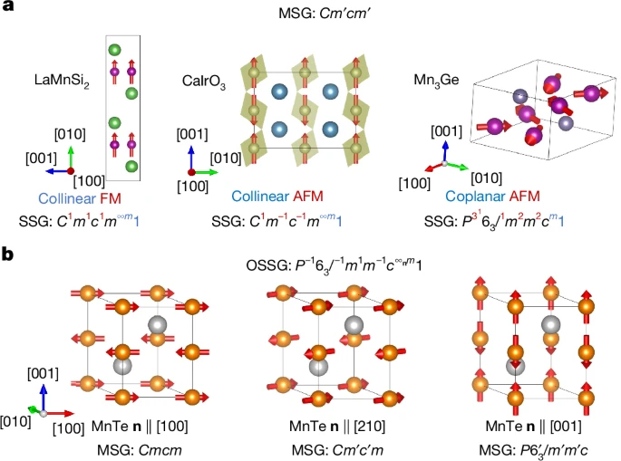
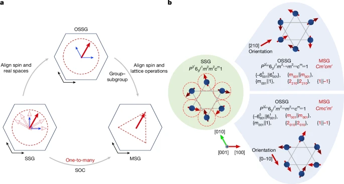
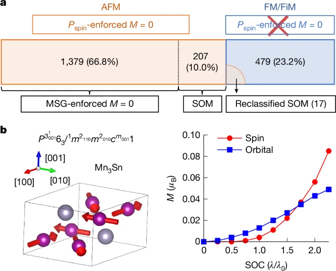
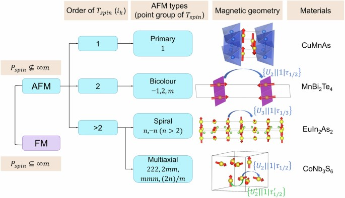
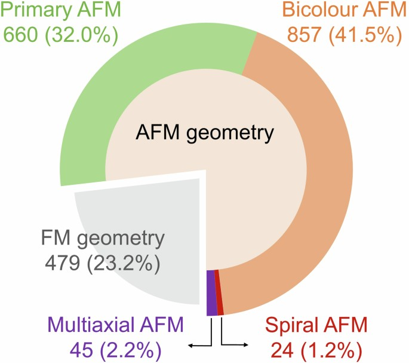
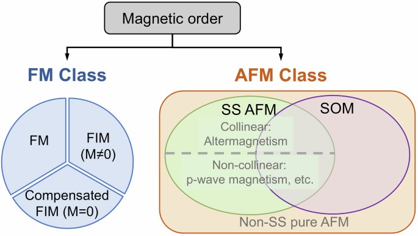
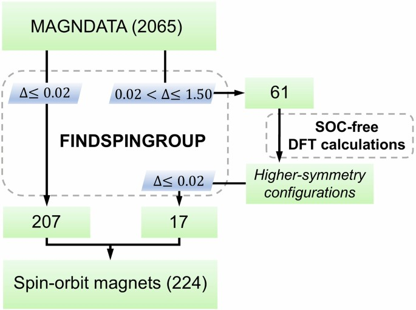

# Symmetry classification of magnetic orders using oriented spin space groups

## Abstract

Magnetism has seen substantial progress in recent decades, driven largely by its potential for next-generation storage devices. However, the classification of magnetic orders, even for fundamental concepts such as ferromagnetism (FM) and antiferromagnetism (AFM), remains a topic of active evolution, particularly with the discovery of unconventional magnetic materials and advances in antiferromagnetic spintronics[^1][^2][^3][^4]. Here we present a classification of magnetic order using the state-of-the-art spin space group (SSG) theory[^5][^6][^7][^8][^9][^10][^11]. On the basis of whether the net spin magnetization is constrained to zero by the SSG framework, we systematically categorize magnetic orders into FM (including ferrimagnetism) and AFM. We further introduce an ‘oriented spin space group’ (OSSG) description, that is, a SSG with a fixed magnetic orientation, thereby unifying the SSG and magnetic space group (MSG)[^12][^13][^14] frameworks. This approach clearly reveals the symmetry-breaking pathway induced by spin–orbit coupling (SOC). On the basis of the proposed group framework, we identify a distinct magnetic phase, termed spin–orbit magnetism (SOM), in which the net spin magnetization is induced by SOC. Our work provides a comprehensive symmetry-based perspective for classifying magnetic order, offering fresh insights into unconventional magnets and broad applicability in spintronics and quantum materials design.

## Main

The established classification of magnetic order is fundamentally rooted in the dichotomy between FM and AFM. Recent advances in spintronics have led to the discovery of new magnetic phenomena and the emergence of materials with unconventional magnetism. These include complex magnetic structures, such as helimagnetism[^15][^16], as well as symmetry-protected magnetic states defined by specific physical responses, such as altermagnetism[^17] and kinetomagnetism[^18]. Although these new concepts are driving progress in spintronics, the absence of a rigorous, systematic classification framework has made it challenging to clarify the relationships between these unconventional magnetic phases and the conventional categories of FM and AFM[^19].

Historically, the dichotomy of FM and AFM is based on the net spin magnetization $M_{s}$ within a unit cell. Specifically, AFM refers to an ordered magnetic geometry with zero net spin magnetization ($M_{s}$ = 0) resulting from antiparallel spin alignment. In 1948, Néel proposed a refined definition of AFM under the condition $M_{s}$ = 0, emphasizing that magnetic sublattices with opposite spins must be crystallographically equivalent[^20]. In other words, the $M_{s}$ = 0 condition, which applies to both collinear and noncollinear magnetic orders, must be enforced by certain symmetries. A classic example is the one-dimensional AFM chain, in which the two magnetic sublattices are related by translation symmetry. By contrast, magnets with inequivalent magnetic sublattices yet vanishing $M_{s}$, referred to as compensated ferrimagnets, typically show different behaviours in the magnetization versus temperature curve (*M* – *T*) and hysteresis loops compared with antiferromagnets, resembling ferromagnets in several aspects[^21][^22].

The key question is: how to mathematically rationalize the dichotomy of FM and AFM? So far, the symmetry of magnetic materials has predominantly been described within the framework of MSGs[^12][^13][^14]. The MSG approach has been profoundly successful and remains a cornerstone of magnetic crystallography. However, because MSGs by definition[^23] restrict the rotation in spin space to be identical to that in real space (thereby implicitly incorporating SOC), they do not fully capture the spin geometries, which reflect the crystallographic feature driven by the isotropic spin exchange but are not robust against SOC. Figure  [1a](#figure-1) shows three magnetic structures that can be easily categorized as collinear FM, collinear AFM and coplanar AFM by bare eyes phenomenologically; however, they share the same MSG *Cm* ′ *cm* ′. As another example, Fig. [1b](#figure-1) considers three magnetic configurations of MnTe that share the same AFM order but differ in Néel vector orientation, resulting in three distinct MSGs. Therefore, although the different MSGs successfully capture the possible SOC response, for example, the anomalous Hall effect (AHE), they inherently describe different physical aspects than the common crystallographic characteristics of the collinear AFM geometry driven by the same exchange interactions.

**Figure 1.** Magnetic structures described by MSGs and SSGs.

**a**, Distinct magnetic geometries (collinear ferromagnetic LaMnSi$_{2}$, collinear antiferromagnetic CaIrO$_{3}$ and coplanar antiferromagnetic Mn$_{3}$Ge) share the same MSG *Cm*′*cm*′. These different spin arrangements can be well described by their different SSGs. The components of the SSG symbols that indicate spin dimensionality (collinearity/coplanarity) and magnetic order (FM/AFM) are highlighted in blue and red, respectively. **b**, Collinear antiferromagnetic MnTe with Néel vector **n** aligned along the [100], [210] and [001] crystal orientations lead to distinct MSGs but the same SSG, describing its identical collinear antiferromagnetic arrangement in all cases. In the context of real materials, we have incorporated the information of the MSG into the SSG notation by aligning the basis vectors in real space and spin space and denoted as OSSG.

To provide a complementary perspective, a symmetry framework known as the SSG[^5][^6][^7][^8][^9][^10][^11], which combines separate spin and spatial operations, can be used to characterize the correlations present in spin geometry arising from isotropic spin exchange. Using SSGs, we will show in this work that a stringent classification of the FM–AFM dichotomy can be established by the condition of having a SSG-enforced null net spin magnetization ($M_{s}$ = 0). This mathematical condition can be taken as a systematic foundation for discussing ‘new types of magnetism’.

Both classical MSG and emerging SSG approaches offer distinct merits for evaluating magnetic materials. To bridge these different methodologies, we introduce the concept of the OSSG. The OSSG encompasses both the SSG and MSG of a structure within a single framework, treating them as a group–subgroup pair to provide a comprehensive, combined description of magnetic materials. In the future, it is up to the broader magnetism community to evaluate various perspectives and use the appropriate approach as the standard nomenclature.

Furthermore, we show that the FM–AFM dichotomy, combined with the condition of MSG-permitted non-zero magnetization, naturally underlies a class of unconventional magnetism, which can be termed SOM because the net spin magnetization is induced by SOC as a consequence of its symmetry breaking. By symmetry analysis and first-principles calculations, we identify 224 SOM candidates from the MAGNDATA database[^24] and reveal their unique magnetization mechanisms, for instance, orbital moments arising from lower-order SOC terms compared with spin moments, implying potential for future devices with vanishing magnetization.

## FM and AFM dichotomy

The definition by Néel[^20] phrases the description of antiferromagnetic order as a crystallographic problem and it can indeed be rigorously defined within the symmetry framework of SSGs. Specifically, if the SSG of a given magnetic structure constrains its net spin magnetization to be zero, it is then classified as AFM; otherwise, it is classified as FM or ferrimagnetism. Furthermore, any non-zero $M_{s}$ not allowed by the SSG but allowed by the corresponding MSG must necessarily be a SOC effect and generally weak compared with the arrangement with the $M_{s}$ = 0 constraint of the SSG.

The general group structure of a SSG consists of $\{g_{s}\Vert g_{l}\mid \tau\}$ operations ($g_{s}$ is a spin-space operation including spin rotation and time-reversal symmetry *T*; $g_{l}$ is a real-space operation including spatial rotation and space inversion *P*; and *τ* stands for a translation). Because the spin magnetization is only restricted by $g_{s}$, we thus define the spin-space point group $P_{\mathrm{spin}}$ by mapping $\{g_{s}\Vert g_{l}\mid \tau\}$ operations to $g_{s}$. $P_{\mathrm{spin}}$ encodes all of the symmetry information of the spin space and can thus be used to classify AFM/FM by its polarity. Specifically, a non-polar $P_{\mathrm{spin}}$ forbids all of the components of the net spin magnetization, leading to SSG-enforced $M_{s}$ = 0. By contrast, a polar $P_{\mathrm{spin}}$ indicates that the SSG symmetry permits a net spin magnetization along a certain orientation. Therefore, FM can be easily identified by $P_{\mathrm{spin}}$ being a subgroup of $∞m$, whereas AFM corresponds to the complementary case. We further categorize two classes of FM with polar $P_{\mathrm{spin}}$ and four classes of AFM with non-polar $P_{\mathrm{spin}}$, as shown in Extended Data Table  [1](#table-2). Specifically, for collinear magnets, as $P_{\mathrm{spin}}$ of a collinear SSG simultaneously has a mirror plane *m* containing the collinear axis, $P_{\mathrm{spin}}$ for collinear FM and collinear AFM must be $∞m$ and $∞/m$ *m*, respectively.

We point out that the geometric features of a given magnetic structure, including its ferromagnetic or antiferromagnetic character and its collinearity or noncollinearity, can be ultimately classified and encoded in the international symbol of its SSG (here we use the Chen–Liu symbol from ref. [^8]). Taking the magnetic structures in Fig. [1a](#figure-1) as examples, for LaMnSi$_{2}$ (SSG: $C^{1}m^{1}c^{1}m^{∞m}1$), its spin-only group $^{∞m}1$ indicates the collinearity and the $P_{\mathrm{spin}}$ is the polar $∞m$ that permits non-zero $M_{s}$ along the collinear axis. Consequently, it is categorized as a collinear FM. Similarly, the $P_{\mathrm{spin}}$ of CaIrO$_{3}$ (SSG: $C^{1}m^{−1}c^{−1}m^{∞m}1$) and Mn$_{3}$Ge (SSG: ${{P}}^{{3}^{1}}6_{3}/^{1}m^{2}m^{2}c^{m}1$) are $∞/mm$ and $−62m$, respectively, both of which are non-polar, indicating antiferromagnetic orderings. Furthermore, the spin-only group $^{∞m}1$ for CaIrO$_{3}$ and $^{m}1$ for Mn$_{3}$Ge denote their collinear and coplanar character, respectively.

SSGs also provide a rigorous symmetry description for complex AFM geometries beyond MSGs, such as helimagnets[^15][^16] and multi-*q* magnets[^25][^26][^27], which are phenomenologically characterized by one or more propagation vectors *q*. Specifically, these geometries can be further classified by a subgroup of their SSG, named spin translational group[^28] $T_{\mathrm{spin}}$. $T_{\mathrm{spin}}$ consists of operations combining a pure spin-space operation and a fractional translation $\{g_{s}\Vert 1\mid \tau\}$. Thus, it directly describes the periodic arrangement of the spin relative orientations. On the basis of the order of $T_{\mathrm{spin}}$ and whether it forms a cyclic group, we classify antiferromagnetic geometries into four distinct categories, ranging from typical Néel-type to multi-*q* AFM, and detail representative materials for each in Extended Data Fig. [1](#extended-data-figure-1) (also see [Methods](#methods)). Unlike MSGs, which are limited to distinguishing odd and even supercell expansions (through *Tτ* symmetry) relative to the paramagnetic phase[^29], SSGs provide a framework for classifying more complex observed magnetic geometries, especially in cases of noncollinear AFM orders.

In Fig. [1b](#figure-1), the spin arrangements of MnTe with the same AFM order but different orientations of the spin moments belong to the same type of SSG $P^{−1}6_{3}/^{−1}m^{1}m^{−1}c^{∞}^{m}1$. The SSG preserves all geometric properties of the magnetic structure: its spatial part captures the hexagonal symmetry of the crystal lattice; its spin-only group $^{∞m}1$ and non-polar $P_{\mathrm{spin}}$ = $∞/mm$ accurately describe its collinear antiferromagnetic character. By comparison, the different MSGs capture the possible physical responses originating from SOC through the coupling of spin and lattice degrees of freedom, which depends on this orientation. Next we introduce a new theoretical approach, named OSSG, to unify the SSG and MSG labelling schemes for a comprehensive description of magnetic materials. This formulation enables the SSG, which describes the magnetic geometry of real materials, to simultaneously account for SOC-related physical effects. More importantly, it provides an intuitive symbol system for visualizing the SOC-induced symmetry-breaking process from SSG to MSG.

## Oriented spin space groups

In the standard international symbol of SSGs, there is no preferred orientation for individual magnetic moments, allowing for a collective *SO* (3) rotation of all magnetic moments by an arbitrary angle. By contrast, a realistic magnetic single crystal typically takes on an energetically favoured orientation of its magnetic moments. Therefore, in the OSSG framework, we specify the spin orientation relative to the lattice and implement this feature into the International Symbol system of SSGs. As shown in Fig. [1b](#figure-1), the OSSG of MnTe is denoted as ${P}^{-1}{6}_{3}{/}^{-1}{m}^{1}{m}^{-1}{c}^{{\infty }_{\mathbf{n}}m}1$, in which the subscript **n** represents the spin orientation relative to the lattice basis vectors, corresponding to the Néel vector directions [100], [210] and [001] from left to right panels, respectively.

When SOC is imposed, only a subset of the OSSG symmetry operations is preserved, namely those operations $\{g_{s}\Vert g_{l}\mid \tau\}$ in which the spatial and spin operations are coupled, so that $g_{l}$ and $g_{s}$ contain the same proper rotation. These operations form a subgroup of the OSSG, which can be identified as the MSG of the structure. Consequently, the OSSG assigned to a magnetic structure inherently includes all of the symmetry operations of the MSG of the structure as a subgroup, as summarized in Fig. [2a](#figure-2). In Fig. [2b](#figure-2), we use Mn$_{3}$Sn as an example, in which the orientation of the spins with respect to the lattice can be specified by the spin direction of the Mn atom with lowest *x* and *z* coordinates. When this orientation is [210], if the spin operations are described in the same basis as the spatial ones, the corresponding OSSG can be labelled as ${P}^{{3}_{001}^{1}}{6}_{3}{/}^{1}{m}^{{2}_{1-10}}{m}^{{2}_{210}}c{}^{{m}_{001}}1$, which contains the MSG *Cm* ′ *cm* ′ (with its standard *b* axis along [210]). This MSG, which can be generated by the coupled operations $\{m_{001}\Vert m_{001}\mid 0,0,1/2\}$, $\{2_{210}\Vert 2_{210}\mid 0,0,1/2\}$ and $\{1\Vert -1\mid 0\}$, is the one to be assigned to the structure. If instead the orientation is [0−10], the corresponding OSSG is ${P}^{{3}_{001}^{1}}{6}_{3}{/}^{1}{m}^{{2}_{110}}{m}^{{2}_{010}}{c}^{{m}_{001}}1$, having a different MSG subgroup, namely one of type *Cmc* ′ *m* ′ (with its standard *a* axis along the [010] direction of the OSSG). This MSG is generated, for instance, by the coupled operations $\{m_{001}\Vert m_{001}\mid 0,0,1/2\}$, $\{2_{010}\Vert 2_{010}\mid 0\}$ and $\{1\Vert -1\mid 0\}$.

**Figure 2.** The relation between OSSG, SSG and MSG.

**a**, Because a SSG does not distinguish the collective rotation of local moments (dashed red arrows), considering SOC may lead to several MSGs. By aligning spin space and real space, an OSSG retains all of the operations of a SSG but its spin-space operations are specified relative to the lattice. Furthermore, SOC aligns spin and lattice operations so that their rotational parts are identical, reducing the OSSG to its subgroup, that is, the MSG. The red arrow is a representative vector of the local moment, the black and blue arrows denote the lattice and spin coordinate systems, respectively, and the dashed triangle indicates that the MSG is a subgroup obtained from the symmetry breaking of the OSSG. **b**, Example of Mn$_{3}$Sn with two different spin configurations. In SSG, the spin (red arrows) and lattice (blue spheres and connecting lines) are not coupled, thus the two configurations cannot be distinguished. The OSSG includes all symmetry operations of the SSG but fixes an orientation ([210] or [0−10]) in real space, thereby distinguishing the different configurations. In the MSG, the spin is bound to the lattice, thus it contains only those operations for which the real-space and spin-space rotation components are identical (marked in red). For convenience, the translation parts have been omitted.

In essence, given an OSSG, imposing the spin–lattice coupling condition reduces the relevant symmetry to its subgroup formed by all coupled operations. This subgroup constitutes the MSG of the material, under which all possible SOC effects are allowed. From the historical development of magnetism, early studies focused mainly on the MSG, whereas the application of OSSG was largely overlooked. Incorporating the OSSG perspective can therefore enrich the understanding of the underlying symmetry logic of magnetism. Considering the group–subgroup relation of the OSSG and MSG of a magnetic structure facilitates the study of SOC-driven properties as a symmetry-breaking process. In particular, certain antiferromagnetic orderings under SOC-related mechanisms, such as Dzyaloshinskii–Moriya interactions[^30], can exhibit emergent macroscopic magnetization or AHEs, which can be rigorously classified as spin–orbit-induced magnetism using only symmetry arguments.

## Spin–orbit magnetism

In a well-defined antiferromagnetic material in which zero spin magnetization is enforced by its OSSG, the inclusion of SOC reduces its symmetry to an OSSG subgroup that may no longer enforce $M_{s}$ = 0. It is therefore natural to identify a specific regime within the AFM category based on the comparison of the constraint on the magnetization by the OSSG and by the subgroup symmetry to be considered under spin–lattice coupling. Specifically, the presence of SOC leads to a distinct type of magnetism that can be termed SOM, in which a net spin magnetization arises exclusively from SOC.

As the OSSG subgroup relevant under SOC can be identified with the MSG of the material, we formulate the symmetry criterion for SOM as follows: the material exhibits SOM if its SSG enforces $M_{s}$ = 0 while its MSG does not (Fig. [3a](#figure-3)). This criterion unambiguously defines a class of antiferromagnetic systems that can host FM-like properties related to finite magnetization, such as the AHE[^3][^31][^32][^33][^34], the magneto-optical Kerr effect[^35][^36] and so on. More importantly, SOM encompasses previously loosely defined concepts such as weak FM[^30][^37][^38][^39], while providing a unified symmetry-based theoretical framework for their description. Moreover, SOM also includes recently reported materials exhibiting magnetic-order-induced orbital magnetization[^26][^27], offering new insights into their relationship with conventional FM and AFM and the role of SOC.

**Figure 3.** Concept of SOM and classification of magnetic materials.

**a**, Classification of magnetic materials based on the condition of symmetry-enforced *M* = 0 within the spin-space point group $P_{\mathrm{spin}}$ (or SSG) and MSG. The quantities and proportions of each type of materials in the MAGNDATA database are presented, including DFT-assisted identification. **b**, Left, crystal structure and magnetic configuration of Mn$_{3}$Sn. Right, the spin and orbital magnetizations of Mn$_{3}$Sn as a function of SOC strength obtained from DFT calculations. The horizontal axis represents the ratio of the SOC coefficient used in the calculation (*λ*) to the actual SOC value for Mn$_{3}$Sn ($λ_{0}$).

The OSSG framework offers a comprehensive characterization of the physical properties of SOM, as it inherently captures the pathway of the symmetry breaking induced by SOC. To show how SOC breaks the OSSG symmetry, we parameterize the SOC Hamiltonian as a SOC tensor, which facilitates tracking its transformation under OSSG operations ([Methods](#methods)). In this way, we can derive from the constraint of the OSSG whether the SOC-driven magnetization is a first-order or a higher-order effect.

As an example, we apply such a theoretical approach to evaluate the spin and orbital magnetizations of noncollinear Mn$_{3}$Sn (Fig. [3b](#figure-3)), which is identified as SOM with an antiferromagnetic OSSG ${P}^{{3}_{001}^{1}}{6}_{3}{/}^{1}{m}^{{2}_{110}}{m}^{{2}_{010}}{c}^{{m}_{001}}1$. The fully coupled operations present in the OSSG, $\{m_{001}\Vert m_{001}\mid 0,0,1/2\}$, $\{2_{010}\Vert 2_{010}\mid 0\}$ and $\{1\Vert -1\mid 0\}$, form the MSG *Cmc* ′ *m* ′. Under OSSG-enforced constraints for the tensors, both $\mathbf{M}_{s}$ and $\mathbf{M}_{o}$ vectors lie along the OSSG [010] direction ([Methods](#methods)), as expected from the corresponding MSG. Notably, the OSSG allows for separating the possible orbital and spin contributions to the magnetization, which are not distinguished by the MSG. The important information for Mn$_{3}$Sn is that the SOC-induced magnetization of orbital origin, $\mathbf{M}_{o}$, is proportional to *λ*, whereas $\mathbf{M}_{s}$ is proportional to $λ^{2}$. This different polynomial dependence on SOC strength is confirmed by our density functional theory (DFT) calculations (Fig. [3b](#figure-3)). In general, lower-order SOC terms are more important than higher-order ones, offering further insights into the magnitude of physical effects. Thus, the OSSG and SOC tensor framework can identify promising AFM candidates with a relatively large AHE (transformed as $\mathbf{M}_{o}$) yet a small net spin magnetization ([Methods](#methods)).

The symmetry constraints of the magnetizations in FM, SOM and non-SOM AFM (MSG-enforced $\mathbf{M}_{s}$ = 0, termed pure AFM hereafter), summarized in Table  [1](#table-1), indicate the fundamental differences among the three types of magnetism. Within the SSG framework, the SOC effects could be described in the *n*th-order term of the SOC expansion, whereas the non-SOC effects are reflected in the zeroth-order term $λ^{0}$. Specifically, the existence of $λ^{0}$ terms in $\mathbf{M}_{s}$ is crucial for distinguishing between the SOM and FM phases, whereas a pure AFM phase exhibits a clear distinction from the SOM and FM ones, because in a pure AFM phase, both $\mathbf{M}_{s}$ and $\mathbf{M}_{o}$ are zero at all orders of *λ*. Furthermore, the OSSG of SOM may allow $λ^{0}$ terms in $\mathbf{M}_{o}$, occurring only in the case of noncoplanar materials, as the SSGs of all collinear and coplanar structures force it to be zero[^7][^8][^27][^40].

Considering only the MSG of a structure, we can determine whether possible SOC-induced responses, such as AHE, are necessarily zero, but we cannot differentiate magnetic geometries that have the same MSG but a different separation of SOC-free and SOC-driven properties (Fig. [1a](#figure-1)). Indeed, the two examples, collinear antiferromagnetic CaIrO$_{3}$ and coplanar antiferromagnetic Mn$_{3}$Ge, shown in Fig. [1a](#figure-1), having the same MSG as the ferromagnetic LaMnSi$_{2}$, belong to the SOM category. This can be immediately derived from their OSSG.

## Materials

The comprehensive symmetry classification introduced in this work provides an efficient route to identify the magnetic order of magnetic materials on a large scale. Such identification has been done using our online program FINDSPINGROUP ([https://findspingroup.com](https://findspingroup.com/)), which can be used to identify the OSSG of any given magnetic structure. By this means, we have identified the magnetic orders and their OSSG of 2,065 experimentally reported magnets available in the MAGNDATA database of the Bilbao Crystallographic Server[^24]. The dichotomy of FM and AFM by means of their $P_{\mathrm{spin}}$ classifies 479 structures as ferromagnetic materials (including 36 compensated ferrimagnets) and 1,586 as antiferromagnetic materials, accounting for 33.2% and 66.8% of the screened materials, respectively. An exhaustive list of all materials and their OSSGs is provided in Supplementary Information sections  [1.1](https://www.nature.com/articles/s41586-026-10401-1#MOESM1) and [1.2](https://www.nature.com/articles/s41586-026-10401-1#MOESM1).

The MSGs of 207 materials identified as antiferromagnetic (10.0% of total) do not constrain $\mathbf{M}_{s}$ = 0, thus corresponding to the SOM category (Fig. [3a](#figure-3) and Supplementary Information section  [2.1](https://www.nature.com/articles/s41586-026-10401-1#MOESM1)). It is important to emphasize that the magnetic structures in the MAGNDATA database are experimental ones obtained through neutron diffraction techniques and may include SOC-driven features, which lower the identified SSG relative to that of a SOC-free structure. Consequently, some SOM materials may be wrongly identified as ferromagnetic because their SOC-induced magnetization exceeds the tolerance threshold used in the SSG assignment. To address this problem, we perform auxiliary evaluations by SOC-free DFT calculations ([Methods](#methods)). If the calculated magnetic configuration in the absence of SOC restores a higher-symmetry $P_{\mathrm{spin}}$ that constrains $\mathbf{M}_{s}$ = 0, the material is reidentified as SOM. This process enabled us to identify 17 more SOM materials (Fig. [3a](#figure-3), [Methods](#methods) and Supplementary Information section  [2.2](https://www.nature.com/articles/s41586-026-10401-1#MOESM1)).

Finally, we discuss the relationship between recently emergent ‘new magnetism’ and our classification scheme. Our symmetry-based FM/AFM dichotomy, rooted in Néel’s original definition, provides the foundation for further categorization of magnetism. The new magnets, which exhibit zero net magnetization yet unconventional properties, essentially belong to a higher-level classification within the AFM category. For instance, if spin splitting in momentum space (SOC-free) is taken as the target functionality, we can rigorously define spin-split AFM and further classify them into collinear subsets, that is, altermagnetism, and noncollinear subsets such as *p*-wave magnetism[^41] and so on. On the other hand, if SOC-induced magnetization is considered, the corresponding class would be SOM. Therefore, distinct classes of unconventional magnetism do not necessarily encompass one another[^19]. For example, spin-split AFM and SOM constitute two independent subclasses of AFM, whereas in three-dimensional collinear magnets, there is a coincidence that SOM forms a subset of altermagnets. In the representative altermagnet MnTe, however, the observed AHE does not arise from altermagnetism per se but rather from the fact that its measured magnetic configuration falls within the SOM category. In Extended Data Fig. [3](#extended-data-figure-3), we illustrate the classifications of the two types of unconventional magnetism.

## Methods

### Further classification of magnetic geometries based on the FM/AFM dichotomy

On the basis of the FM/AFM dichotomy, the SSG framework enables further classification of magnetic geometry. Here we focus on the SSG-based classification of various antiferromagnetic geometries, especially for noncollinear magnets, which were also phenomenologically described previously such as Néel-type, spiral and multi-*q* AFM. Experimentally, the spin distribution across crystallographic primitive cells is typically described by the propagation vector *q*. However, *q* alone cannot capture the complexity of the magnetic geometry within a single primitive cell. Moreover, when the lattice periodicity and the propagation vector period are mismatched, *q* fails to reflect the modulation of the crystal field on the magnetic configuration. Furthermore, even the propagation of spiral magnetic order is hardly captured by MSGs, necessitating the application of SSGs.

As mentioned in the main text, we introduce spin translational group $T_{\mathrm{spin}}$, which consists of the combination of pure spin-space operation and fractional translation $\{g_{s}\Vert 1\mid \tau\}$. Because the components of $T_{\mathrm{spin}}$, $g_{s}$ and *τ* act in different spaces and their multiplicative actions commute, the group $T_{\mathrm{spin}}$ follows the group structure of its *τ* component and is, thus, Abelian.

The classification constitutes four distinct categories, as shown in Extended Data Fig. [1](#extended-data-figure-1). For $i_{k}$ = 1, $T_{\mathrm{spin}}$ only consists of the identity operation and the complexity of magnetic geometry is only included in the magnetic primary cell. A typical example is CuMnAs with antiparallel spin arrangement for the two Mn atoms within a primary cell. Therefore, such a type of AFM is classified as primary AFM. In the case of $i_{k}$ = 2, $T_{\mathrm{spin}}$ has an order 2 spin translational operation, whose spin-space part can be −1, 2 or *m*. Examples include the intrinsic magnetic topological insulator MnBi$_{2}$Te$_{4}$ (refs. [^42][^43]), which has two magnetic atoms with antiparallel spin connected by $\{U_{2}\Vert 1\mid \tau_{1/2}\}$ (${\tau }_{1/2}=0,0,\frac{1}{2}$). Owing to the correspondence between the collinear SSG and MSG in the group structure, its group symbol can be simplified as $R_{I}^{1}−3^{1}m^{∞m}1$. Such a category aligns with the pedagogical one-dimensional AFM chain, referred to as bicolour AFM.

The case of $i_{k}$ > 2 could be further divided into two categories based on whether $T_{\mathrm{spin}}$ is cyclic. If $T_{\mathrm{spin}}$ is a cyclic group, such as *n*, − *n* (*n*  > 2), the magnetic geometry aligns with a high-order spin rotation associated with translation. We select EuIn$_{2}$As$_{2}$ as an example in which the magnetic moments are connected by $\{U_{3}\Vert 1\mid \tau_{1/3}\}$, forming a so-called spiral AFM[^8][^44]. Finally, if $T_{\mathrm{spin}}$ is a non-cyclic Abelian group, the spin rotations with different axes must be mapped to translations in different directions. Such mappings result in a more intricate multi-*q* magnetic geometry, as observed in antiferromagnetic [111]-strained cubic γ-FeMn (ref. [^26]) and CoNb$_{3}$S$_{6}$ (ref. [^27]), referred to as multiaxial AFM. Apparently, both spiral and multiaxial AFM cannot be described by MSGs, in which the corresponding $T_{\mathrm{spin}}$ only allows $\{-1\Vert 1\mid \tau\}$ operation. Furthermore, FM can also be classified into the four categories in the same way. For example, a helimagnet with AFM geometries and a FM magnetic canting can be directly described by combining a $T_{\mathrm{spin}}$ with $i_{k}$ > 2 and a polar $P_{\mathrm{spin}}$.

Extended Data Fig. [2](#extended-data-figure-2) summarizes the quantities and proportions of materials exhibiting each type of AFM geometry in the MAGNDATA database obtained by our online program FINDSPINGROUP. On the basis of $T_{\mathrm{spin}}$, AFM geometries are further classified into primary (660, 32.0%), bicolour (857, 41.5%), spiral (24, 1.2%) and multiaxial (45, 2.2%) categories. In Supplementary Information sections  [2.1](https://www.nature.com/articles/s41586-026-10401-1#MOESM1) and [2.2](https://www.nature.com/articles/s41586-026-10401-1#MOESM1), we provide an exhaustive list of all materials and their oriented SSG including the dichotomy of FM/AFM and further geometries classification based on $T_{\mathrm{spin}}$.

### SOC tensor

To describe the transformation of SOC under SSG operations, we reformulate it in a form that explicitly allows for independent coordinate systems in real space and spin space:

$$
\begin{array}{c}\begin{array}{c}\begin{array}{c}{\hat{H}}_{\mathrm{SOC}}={\lambda }{\hat{\mathbf{L}}}^{\mathrm{T}}{\boldsymbol{\chi }}\hat{{\boldsymbol{\sigma }}}=\lambda \sum _{i,j}{\chi }_{{ij}}{\hat{L}}_{i}{\hat{\sigma }}_{j}\\ =\,\lambda ({\hat{L}}_{1}\,{\hat{L}}_{2}\,{\hat{L}}_{3})\left(\begin{array}{ccc}{\mathbf{r}}_{1}\cdot {\mathbf{s}}_{1} & {\mathbf{r}}_{1}\cdot {\mathbf{s}}_{2} & {\mathbf{r}}_{1}\cdot {\mathbf{s}}_{3}\\ {\mathbf{r}}_{2}\cdot {\mathbf{s}}_{1} & {\mathbf{r}}_{2}\cdot {\mathbf{s}}_{2} & {\mathbf{r}}_{2}\cdot {\mathbf{s}}_{3}\\ {\mathbf{r}}_{3}\cdot {\mathbf{s}}_{1} & {\mathbf{r}}_{3}\cdot {\mathbf{s}}_{2} & {\mathbf{r}}_{3}\cdot {\mathbf{s}}_{3}\end{array}\right)\,\left(\begin{array}{c}{\hat{\sigma }}_{1}\\ {\hat{\sigma }}_{2}\\ {\hat{\sigma }}_{3}\end{array}\right),\end{array}\end{array}\end{array}
$$

(1)

in which *λ*, $\hat{\mathbf{L}}$ and $\hat{{\boldsymbol{\sigma }}}$ represent the SOC coefficient, effective orbital angular momentum operator and spin operator, respectively; $\mathbf{r}_{i}$ and $\mathbf{s}_{j}$ are the unit base vectors with *i*  = 1, 2, 3 and *j*  = 1, 2, 3 for real space and spin space, respectively; **χ** represents a 3 × 3 SOC tensor matrix, defined as **χ**  = {$χ_{ij}$ = $\mathbf{r}_{i}$ · $\mathbf{s}_{j}|$ *i*  = 1, 2, 3; *j*  = 1, 2, 3}. For a general SSG operation $\{g_{s}\Vert g_{l}\}$, the transformation of **χ** can be expressed as:

$$
\begin{array}{l}{\hat{\rho }}_{\{{g}_{\mathrm{s}}||{g}_{\mathrm{l}}\}}^{-1}\lambda {\hat{\mathbf{L}}}^{\mathrm{T}}{\boldsymbol{\chi }}\hat{{\boldsymbol{\sigma }}}{\hat{\rho }}_{\{{g}_{\mathrm{s}}||{g}_{\mathrm{l}}\}}\,=\,\lambda det({R}_{\mathrm{s}})det({R}_{\mathrm{l}})[{\hat{\mathbf{L}}}^{\mathrm{T}}{R}_{\mathrm{l}}^{-1}]{\boldsymbol{\chi }}[{R}_{\mathrm{s}}\hat{{\boldsymbol{\sigma }}}]\\ \,\,\,\,\,\,\,\,\,=\,\lambda {\hat{\mathbf{L}}}^{\mathrm{T}}det({R}_{\mathrm{s}})det({R}_{\mathrm{l}})[{R}_{\mathrm{l}}^{-1}{\boldsymbol{\chi }}{R}_{\mathrm{s}}]\hat{{\boldsymbol{\sigma }}}\end{array}
$$

(2)

in which $\{\hat{\rho }}_{\{{g}_{\mathrm{s}}\Vert {g}_{\mathrm{l}}\}\}$ is the representation operator of $\{g_{s}\Vert g_{l}\}$ in Hilbert space; $R_{l}$ and $R_{s}$ are three-dimensional Euclidean transformations corresponding to $g_{l}$ and $g_{s}$ in three-dimensional real space and spin space, respectively. det($R_{l}$) and det($R_{s}$) are the determinants of $R_{l}$ and $R_{s}$, respectively; their values, either −1 or 1, depend on whether $R_{l}$ includes the space-inversion operation and whether $R_{s}$ includes the time-reversal operation, respectively. Therefore, the transformation of the SOC term under a SSG operation can be described using the SOC tensor **χ**, based on its defined transformation rule:

$$
{\boldsymbol{\chi }}\mathop{\longrightarrow }\limits^{\{{g}_{\mathrm{s}}||{g}_{\mathrm{l}}\}}{{\boldsymbol{\chi }}}^{{\prime} }=det({R}_{\mathrm{s}})det({R}_{\mathrm{l}}){R}_{\mathrm{l}}^{-1}{\boldsymbol{\chi }}{R}_{\mathrm{s}}
$$

(3)

A similar method has also been applied to investigate the AHE in ferromagnetic systems[^45].

### Material example for orbital and spin magnetization: Mn3Sn

In the following, we use the orbital magnetization $\mathbf{M}_{o}$, the spin magnetization $\mathbf{M}_{s}$ and noncollinear antiferromagnetic Mn$_{3}$Sn (Fig. [3b](#figure-3)) as examples to demonstrate how to analyse the SOC-induced physical properties by SOC tensor **χ**. By definition, $\mathbf{M}_{o}$ and $\mathbf{M}_{s}$ are the sums of the expectation values of orbital angular momentum operator $\hat{{\mathcal{L}}}$ and spin operator $\hat{{\boldsymbol{\sigma }}}$ over the entire Brillouin zone, respectively, expressed as:

$$
{\mathbf{M}}_{\mathrm{o}}=-\frac{{\mu }_{\mathrm{B}}{{\mathcal{g}}}_{\mathrm{o}}}{2\mathrm{\pi }}{\int }_{\mathrm{B}\mathrm{Z}}\sum _{n}{f}_{n\mathbf{k}}\langle {{\varphi }}_{n}(\mathbf{k})|\hat{{\mathcal{L}}}|{{\varphi }}_{n}(\mathbf{k})\rangle \mathrm{d}\mathbf{k}
$$

(4)

$$
{\mathbf{M}}_{\mathrm{s}}=-\frac{{\mu }_{\mathrm{B}}{{\mathcal{g}}}_{\mathrm{s}}}{2\mathrm{\pi }}{\int }_{\mathrm{B}\mathrm{Z}}\sum _{n}{f}_{n\mathbf{k}}\langle {{\varphi }}_{n}(\mathbf{k})|\hat{{\sigma }}|{{\varphi }}_{n}(\mathbf{k})\rangle \mathrm{d}\mathbf{k}
$$

(5)

in which $f_{n\mathbf{k}}$ is the Fermi distribution at wavevector **k**; $μ_{B}$ represents the Bohr magneton; and ${{\mathcal{g}}}_{\mathrm{o}}$ and ${{\mathcal{g}}}_{\mathrm{s}}$ denote the Landé ${\mathcal{g}}$-factors for orbital and spin, respectively. Consequently, the transformations of $\mathbf{M}_{o}$ and $\mathbf{M}_{s}$ are equivalent to time-reversal-odd axial vectors and follow the corresponding proper rotation operations in real space and spin space, respectively, expressed as:

$$
{\mathbf{M}}_{\mathrm{o}}\mathop{\longrightarrow }\limits^{\{{g}_{\mathrm{s}}||{g}_{\mathrm{l}}\}}det({R}_{\mathrm{s}})det({R}_{\mathrm{l}}){R}_{\mathrm{l}}{\mathbf{M}}_{\mathrm{o}}
$$

(6)

$$
{\mathbf{M}}_{\mathrm{s}}\mathop{\longrightarrow }\limits^{\{{g}_{\mathrm{s}}||{g}_{\mathrm{l}}\}}{R}_{\mathrm{s}}{\mathbf{M}}_{\mathrm{s}}
$$

(7)

To analyse the coupling relationship between $\mathbf{M}_{o}$, $\mathbf{M}_{s}$ and *λ* **χ**, we express both $\mathbf{M}_{o}$ and $\mathbf{M}_{s}$ as a series expansion in terms of *λ* **χ**:

$$
{M}_{a}[{\boldsymbol{\chi }}]={\omega }_{a}^{(0)}+\lambda \sum _{{ij}}{\omega }_{a,{ij}}^{(1)}{\chi }_{{ij}}+{\lambda }^{2}\sum _{{ijkl}}{\omega }_{a,{ij},{kl}}^{(2)}{\chi }_{{ij}}{\chi }_{{kl}}+\ldots
$$

(8)

in which $\mathbf{ω}^{(n)}$ is a ($2n$ + 1)th-order undetermined tensor. Equation ([8](#equation-8)) is constrained by the OSSG symmetry and is valid both for $\mathbf{M}_{o}$ and $\mathbf{M}_{s}$, but in each case, different transformation properties have to be considered for the tensors $\mathbf{ω}^{(n)}$ owing to the restriction:

$$
det({R}_{\mathrm{s}})det({R}_{\mathrm{l}}){R}_{\mathrm{l}}{\mathbf{M}}_{\mathrm{o}}[\,{\boldsymbol{\chi }}]={\mathbf{M}}_{\mathrm{o}}[det({R}_{\mathrm{s}})det({R}_{\mathrm{l}}){R}_{\mathrm{l}}\,{\boldsymbol{\chi }}{R}_{\mathrm{s}}^{-1}]
$$

(9)

$$
{R}_{\mathrm{s}}{\mathbf{M}}_{\mathrm{s}}[\,{\boldsymbol{\chi }}]={\mathbf{M}}_{\mathrm{s}}[det({R}_{\mathrm{s}})det({R}_{\mathrm{l}}){R}_{\mathrm{l}}\,{\boldsymbol{\chi }}{R}_{\mathrm{s}}^{-1}]
$$

(10)

Once the properties of $\mathbf{ω}^{(n)}$ have been established, the same basis in real space and spin space can be chosen (that is, $χ_{ij}$ = $δ_{ij}$), fixing the spin orientation to that defined by the OSSG. Equation ([8](#equation-8)) then strongly simplifies and only very specific components of the OSSG symmetry-adapted tensors $\mathbf{ω}^{(n)}$ become relevant.

The SOM material Mn$_{3}$Sn has the OSSG ${P}^{{3}_{001}^{1}}{6}_{3}{/}^{1}{m}^{{2}_{110}}{m}^{{2}_{010}}{c}^{{m}_{001}}1$. The point operation parts of the OSSG generators include $\{1\Vert -1\}$, $\{-{6}_{001}^{5}\Vert {6}_{001}^{1}\}$, $\{2_{100}\Vert 2_{1-10}\}$ and $\{m_{001}\Vert 1\}$. By applying the symmetry constraints of all of the OSSG generators and choosing $χ_{ij}$ = $δ_{ij}$, we can analyse the relationship between $\mathbf{M}_{o}$, $\mathbf{M}_{s}$ and **χ** order by order. For the zeroth-order SOC tensor term, the coefficient $\mathbf{ω}^{(0)}$ remains invariant under all OSSG operations. However, both $\mathbf{M}_{o}$ and $\mathbf{M}_{s}$ transform non-identity under this OSSG. Therefore, the zeroth-order $\mathbf{ω}^{(0)}$ must vanish for all three components of $\mathbf{M}_{o}$ and $\mathbf{M}_{s}$. For the first-order SOC tensor term, by requiring that each component of the tensor $\mathbf{ω}^{(1)}$ remains invariant under the OSSG generators, the OSSG restriction on the first-order coefficient tensor ${{\boldsymbol{\omega }}}_{\mathrm{o}}^{(1)}$ for $\mathbf{M}_{o}$ can be obtained by combining equations ([8](#equation-8)) and ([9](#equation-9)). Applying the same method to the symmetry constraints of $\mathbf{M}_{s}$, we find that all first-order SOC tensor terms of $\mathbf{M}_{s}$ are forbidden by the SSG symmetry. Expressed in an orthonormal basis parallel to the directions (**a**, $2\mathbf{b}$ +  **a**, **c**), the expansion of the spin magnetization $\mathbf{M}_{s}$ and the orbital magnetization $\mathbf{M}_{o}$ (to the lowest non-zero order terms) can be written as:

$$
{M}_{\mathrm{s},1}=2({\omega }_{\mathrm{s},1,1111}^{(2)}+{\omega }_{\mathrm{s},1,2222}^{(2)}){\lambda }^{2},{M}_{\mathrm{s},2}=-2\sqrt{3}({\omega }_{\mathrm{s},1,1111}^{(2)}+{\omega }_{\mathrm{s},1,2222}^{(2)}){\lambda }^{2}
$$

(11)

$$
{M}_{\mathrm{o},1}=2{\omega }_{\mathrm{o},1,11}^{(1)}\lambda ,{M}_{\mathrm{o},2}=-2\sqrt{3}{\omega }_{\mathrm{o},1,11}^{(1)}\lambda
$$

(12)

in which $M_{s,i}$ and $M_{o,i}$ represent the *i*th components of $\mathbf{M}_{s}$ and $\mathbf{M}_{o}$ in the mentioned basis, respectively. Both $\mathbf{M}_{s}$ and $\mathbf{M}_{o}$ vectors therefore lie along the OSSG [010] direction, as expected from the corresponding MSG. Note, however, that equations ([11](#equation-11)) and ([12](#equation-12)) have been obtained by applying the symmetry conditions of the OSSG, with no explicit use of the MSG.

Next we discuss the advantages of the SOC tensor framework in identifying promising AFM candidates for the AHE. According to the Kubo formula, the intrinsic anomalous Hall conductivity can be expressed as:

$$
{\sigma }_{z}^{\mathrm{AHE}}=\frac{{e}^{2}}{\hbar }\sum _{{n}^{{\prime} }\ne n}{\int }_{\mathrm{BZ}}\frac{{\mathrm{d}}^{3}k}{{(2\mathrm{\pi })}^{3}}{f}_{\mathbf{k}n}\frac{2\mathrm{Im}[\langle \mathbf{k}n|{\partial }_{{k}_{x}}\hat{H}(\mathbf{k})|\mathbf{k}{n}^{{\prime} }\rangle \langle \mathbf{k}{n}^{{\prime} }|{\partial }_{{k}_{y}}\hat{H}(\mathbf{k})|\mathbf{k}n\rangle ]}{{({{\epsilon }}_{\mathbf{k}n}-{{\epsilon }}_{\mathbf{k}{n}^{{\prime} }})}^{2}},
$$

(13)

in which $f_{\mathbf{k}n}$ is the Fermi–Dirac distribution, $\hat{H}(\mathbf{k})$ is the system Hamiltonian and | **k** *n* ⟩ and | **k** *n* ′⟩ are the eigenstates of the system. From symmetry considerations, the anomalous Hall conductivity vector ${{\boldsymbol{\sigma }}}^{\mathrm{AHE}}=({\sigma }_{x}^{\mathrm{AHE}},{\sigma }_{y}^{\mathrm{AHE}},{\sigma }_{z}^{\mathrm{AHE}})$ transforms as an axial vector in real space and is odd under time-reversal symmetry in spin space. Therefore, it shares the same symmetry transformation properties as the orbital magnetic moment $\mathbf{M}_{o}$ and, consequently, follows the same expansion form in terms of the SOC tensor. Within the MSG framework that includes SOC, AHE and magnetization are subject to the same symmetry constraints—meaning that symmetry either permits both or forbids both simultaneously. On the other hand, our SOC tensor framework enables a systematic comparison of the magnitudes of the AHE (transformed as $\mathbf{M}_{o}$) and the spin magnetization $\mathbf{M}_{s}$, providing insights for realizing a large AHE response in systems with minimal net magnetization.

### Identification of SOM materials

According to the symmetry classification in our paper, spin–orbit magnets exhibit SSG-enforced $M_{s}$ = 0 but not MSG-enforced *M*  = 0, indicating that the net magnetization originates from SOC. To identify the SOM materials in the MAGNDATA database[^24], we use the FINDSPINGROUP program ([https://findspingroup.com](https://findspingroup.com/)) to identify the SSG and MSG of all of the materials with tolerance *∆*  = 0.02 $μ_{B}$ and find 207 SOM materials (left workflow in Extended Data Fig. [4](#extended-data-figure-4)). Here the tolerance *∆* is defined as the allowable magnitude of the vector difference |$\mathbf{M}_{i}$ − $R_{s}\mathbf{M}_{j}|$, in which $\mathbf{M}_{i}$ and $\mathbf{M}_{j}$ are the magnetic moments at atomic sites *i* and *j*, respectively, satisfying the mappings $j\mathop{\to }\limits^{{g}_{\mathrm{l}}}i$ and ${\mathbf{M}}_{j}\mathop{\to }\limits^{{g}_{\mathrm{s}}}{R}_{\mathrm{s}}{\mathbf{M}}_{j}$ under the symmetry operation $\{g_{s}\Vert g_{l}\}$ and $R_{s}$ is a three-dimensional orthogonal transformation in spin space corresponding to $g_{s}$.

Next, to distinguish materials in which the net magnetization is generated by SOC but SSG has been identified as ferromagnetic, we increase the tolerance to 1.50 $μ_{B}$, resulting in the symmetry identification of 61 more possible SOM materials. After excluding materials with strong disorder, using SOC-free DFT calculations, we compare for each material the energy of the magnetic arrangement provided by MAGNDATA with arrangements having a higher SSG. The results indicate that the SOC-free ground states of 17 materials have a SSG of higher symmetry, which does not allow $M_{s}$, and are reidentified as SOM materials, with their $M_{s}$ being characterized as a SOC-driven effect (right workflow in Extended Data Fig. [4](#extended-data-figure-4)). The remaining 44 materials are mainly ferromagnetic systems with tiny magnetizations and disordered systems that are beyond the scope of this symmetry identification. The list of spin–orbit magnets is provided in Supplementary Information section  [2.1](https://www.nature.com/articles/s41586-026-10401-1#MOESM1) and the DFT-reidentified SOM materials are provided in Supplementary Information section  [2.2](https://www.nature.com/articles/s41586-026-10401-1#MOESM1).

In the following, we present material examples to demonstrate the identification of SOM materials. For direct symmetry identification, we use LaMnO$_{3}$ as an example, in which the three components of the local magnetic moments are (3.87 $μ_{B}$, 0, 0). Although the symmetry constraint of its net magnetic moment is (0, $M_{y}$, 0), the local magnetic moment does not have a *y*-direction component within the accuracy (0.02 $μ_{B}$) allowed by the database. As a result, the FINDSPINGROUP program can directly identify its magnetic geometry of collinear AFM and classify it as SOM. The SOM materials with experimental negligible net magnetic moment account for 10.0% of the entire material database, which is the most common situation in SOM.

On the other hand, some materials with SOC-induced net magnetic moments are sufficiently large, requiring auxiliary evaluation by means of DFT calculations. We use NiF$_{2}$ as an example, in which the three components of the local magnetic moments are (2 $μ_{B}$, 0.03 $μ_{B}$, 0). As a result, its net magnetic moment in a unit cell is 0.06 $μ_{B}$, which requires evaluation to determine whether it originates from SOC. We perform SOC-free DFT calculations to compare the total energy of this magnetic configuration with that of the configuration without canting. The results show that the magnetic configuration without canting has lower energy, indicating that the net magnetic moment is induced by SOC. Furthermore, we reidentify the symmetry of the magnetic configuration without canting to confirm the OSSG of the ground-state magnetic configuration without SOC. The revised OSSG of NiF$_{2}$ is ${P}^{-1}{4}_{2}{/}^{1}{m}^{-1}{n}^{1}{m}^{{\infty }_{100}m}1$, confirming SOM.

### DFT calculations

Our DFT calculations are conducted using the Vienna Ab initio Simulation Package (VASP)[^46], which used the projector augmented wave[^47] method. The exchange-correlation functional was described through the generalized gradient approximation of the Perdew–Burke–Ernzerhof formalism[^48][^49] with on-site Coulomb interaction Hubbard *U*, which are provided in Supplementary Information section  [2.2](https://www.nature.com/articles/s41586-026-10401-1#MOESM1) for each material. The plane-wave cut-off energy was set to 500 eV and the total energy convergence criteria was set to 1.0 × $10^{−6}$ eV for all candidate materials. Sampling of the entire Brillouin zone was performed by a Γ-centred Monkhorst–Pack grid[^50], with the standard requiring that the product of the number of *k*-points and the lattice constant exceeds 45 Å for each direction.

## Data availability

All data are available in the [Supplementary Information](https://www.nature.com/articles/s41586-026-10401-1#MOESM1) and through our public website, the online program for identifying the spin (magnetic) space group symmetries and related properties of magnetic materials ([https://findspingroup.com/](https://findspingroup.com/)).

## Code availability

All codes are available through our public website, the online program for identifying the spin (magnetic) space group symmetries and related properties of magnetic materials ([https://findspingroup.com/](https://findspingroup.com/)).

## Acknowledgements

We thank J. Liu and Y. Gao for the helpful discussions. This work was supported by the National Natural Science Foundation of China under grant nos. 12525410, 12274194, 12574275 and 12534003, the National Key R&D Program of China under grant no. 2025YFA1411300, the Guangdong Provincial Quantum Science Strategic Initiative under grant no. GDZX2401002, the Guangdong Provincial Key Laboratory for Computational Science and Material Design under grant no. 2019B030301001, Shenzhen Science and Technology Program (grant nos. RCJC20221008092722009 and 20231117091158001), the Innovative Team of General Higher Educational Institutes in Guangdong Province (grant no. 2020KCXTD001), the Open Fund of the State Key Laboratory of Spintronics Devices and Technologies (grant no. SPL-2407) and Center for Computational Science and Engineering of Southern University of Science and Technology.

## Ethics declarations

### Competing interests

The authors declare no competing interests.

## Peer review

### Peer review information

*Nature* thanks the anonymous reviewer(s) for their contribution to the peer review of this work.

## Extended Data

**Extended Data Figure 1.** [Classification of magnetic orders.](https://www.nature.com/articles/s41586-026-10401-1/figures/4) The dichotomy of FM and AFM orders is classified by the spin-space point group $P_{\mathrm{spin}}$. Furthermore, the geometries of AFM are classified into four categories, that is, primary, bicolour, spiral and multiaxial, based on the order of the spin translational group $T_{\mathrm{spin}}$ and whether it forms a cyclic group (for spiral and multiaxial categories). Examples of representative materials with their magnetic geometries (only magnetic ions are shown) are provided. The spin translational operations of the corresponding SSG for each material are also denoted, in which $U_{n}$ stands for an *n*\-fold rotation in spin space.

**Extended Data Figure 2.** [Statistics of FM and various AFM geometries in the MAGNDATA database.](https://www.nature.com/articles/s41586-026-10401-1/figures/5) The numbers (portion) of FM, primary AFM, bicolour AFM, spiral AFM, and multiaxial AFM are 479 (23.2%), 660 (32.0%), 857(41.5%), 24 (1.2%), and 45 (2.2%), respectively.

**Extended Data Figure 3.** [Relationship between the FM/AFM dichotomy and further classification schemes, including altermagnetism and SOM.](https://www.nature.com/articles/s41586-026-10401-1/figures/6) The FM class can be further classified into FM (*M* ≠ 0), ferrimagnetism (FiM, *M* ≠ 0) and compensated FiM (*M* = 0). The AFM class can also be further classified on the basis of different properties as criteria. Therefore, distinct classes of corresponding classification do not necessarily encompass each other. ‘Non-SS pure AFM’ stands for AFM without either spin splitting or SOC-induced magnetization.

**Extended Data Figure 4.** [Workflow of the identification of SOM.](https://www.nature.com/articles/s41586-026-10401-1/figures/7) The left workflow shows the direct identification of SOM using the FINDSPINGROUP program and the right workflow shows the identification process assisted by SOC-free DFT calculations. The numbers in the green boxes represent the quantity of materials obtained at each step. The blue boxes indicate the tolerance range used by FINDSPINGROUP.

## Tables

**Table 1.** The constraints of symmetry on effects in different magnetic systems 

| Symmetry | Effects | Pure AFM | SOM | FM |
| --- | --- | --- | --- | --- |
| OSSG | $M_{s}$ | 0 | $\sum {\lambda }^{n}$ | ${\lambda }^{0}+\sum {\lambda }^{n}$ |
|  | $M_{o}$ (AHE) | 0 | ${\lambda }^{0}+\sum {\lambda }^{n}$ | ${\lambda }^{0}+\sum {\lambda }^{n}$ |
| MSG | *M* (AHE) | 0 | Not 0 | Not 0 |

[Full size table](https://www.nature.com/articles/s41586-026-10401-1/tables/1)

- **Extended Data Table 1.** All possible spin-space point groups (Pspin) classified by group structures and the corresponding FM/AFM dichotomy ([Full size table](https://www.nature.com/articles/s41586-026-10401-1/tables/2))  — ⚠️ The full-size Nature page did not expose HTML table cells; retained the absolute URL.

## Author notes

- These authors contributed equally: Yuntian Liu, Xiaobing Chen

## Authors and affiliations

- Yuntian Liu, Xiaobing Chen, Yutong Yu & Qihang Liu — State Key Laboratory of Quantum Functional Materials, Department of Physics, and Guangdong Basic Research Center of Excellence for Quantum Science, Southern University of Science and Technology (SUSTech), Shenzhen, China
- Xiaobing Chen & Qihang Liu — Quantum Science Center of Guangdong–Hong Kong–Macao Greater Bay Area (Guangdong), Shenzhen, China
- Jesús Etxebarria & J. Manuel Perez-Mato — Faculty of Science and Technology, University of the Basque Country/Euskal Herriko Unibertsitatea (UPV/EHU), Bilbao, Spain
- Qihang Liu — Guangdong Provincial Key Laboratory of Computational Science and Material Design, Southern University of Science and Technology (SUSTech), Shenzhen, China

## Author contributions

Q.L. conceived the project. Y.L., X.C. and Q.L. constructed the magnetic classification. Y.L., X.C., J.M.P.-M. and Q.L. constructed the theory of oriented spin space group. Y.L., J.E. and J.M.P.-M. derived the spin–orbit tensor formalism. Y.Y. deployed the identification of OSSG in FINDSPINGROUP and performed the screening of SOM materials. Y.L., X.C. and Y.Y. performed the density functional theory calculations and established the database. Y.L., X.C. and Q.L. analysed the results and wrote the paper, with the input of all of the authors.

## Correspondence

Correspondence to Qihang Liu. [liuqh@sustech.edu.cn](mailto:liuqh@sustech.edu.cn)

## References

[^1]: Jungwirth, T., Marti, X., Wadley, P. & Wunderlich, J. Antiferromagnetic spintronics. Nat. Nanotechnol. 11, 231–241 (2016). [doi:10.1038/nnano.2016.18](https://doi.org/10.1038/nnano.2016.18)

[^2]: Baltz, V. et al. Antiferromagnetic spintronics. Rev. Mod. Phys. 90, 015005 (2018). [doi:10.1103/RevModPhys.90.015005](https://doi.org/10.1103/RevModPhys.90.015005)

[^3]: Šmejkal, L., MacDonald, A. H., Sinova, J., Nakatsuji, S. & Jungwirth, T. Anomalous Hall antiferromagnets. Nat. Rev. Mater. 7, 482–496 (2022). [doi:10.1038/s41578-022-00430-3](https://doi.org/10.1038/s41578-022-00430-3)

[^4]: Šmejkal, L., Sinova, J. & Jungwirth, T. Emerging research landscape of altermagnetism. Phys. Rev. X 12, 040501 (2022).

[^5]: Brinkman, W. F. & Elliott, R. J. Theory of spin-space groups. Proc. R. Soc. Lond. A Math. Phys. Sci. 294, 343–358 (1966).

[^6]: Litvin, D. B. & Opechowski, W. Spin groups. Physica 76, 538–554 (1974). [doi:10.1016/0031-8914(74)90157-8](https://doi.org/10.1016/0031-8914(74)90157-8)

[^7]: Liu, P., Li, J., Han, J., Wan, X. & Liu, Q. Spin-group symmetry in magnetic materials with negligible spin-orbit coupling. Phys. Rev. X 12, 021016 (2022).

[^8]: Chen, X. et al. Enumeration and representation theory of spin space groups. Phys. Rev. X 14, 031038 (2024).

[^9]: Xiao, Z., Zhao, J., Li, Y., Shindou, R. & Song, Z.-D. Spin space groups: full classification and applications. Phys. Rev. X 14, 031037 (2024).

[^10]: Jiang, Y. et al. Enumeration of spin-space groups: towards a complete description of symmetries of magnetic orders. Phys. Rev. X 14, 031039 (2024).

[^11]: Corticelli, A., Moessner, R. & McClarty, P. A. Spin-space groups and magnon band topology. Phys. Rev. B 105, 064430 (2022).

[^12]: Shubnikov, A. V. Symmetry and Antisymmetry of Finite Figures (Academy of Sciences of the Soviet Union, 1951).

[^13]: Zamorzaev, A. M. Generalization of Fedorov Groups. Candidate dissertation, Leningrad State Univ. (1953).

[^14]: Bradley, C. J. & Davies, B. L. Magnetic groups and their corepresentations. Rev. Mod. Phys. 40, 359 (1968). [doi:10.1103/RevModPhys.40.359](https://doi.org/10.1103/RevModPhys.40.359)

[^15]: Koehler, W. C. Magnetic properties of rare-earth metals and alloys. J. Appl. Phys. 36, 1078–1087 (1965). [doi:10.1063/1.1714108](https://doi.org/10.1063/1.1714108)

[^16]: Koehler, W. C., Cable, J. W., Wilkinson, M. K. & Wollan, E. O. Magnetic structures of holmium. I. The virgin state. Phys. Rev. 151, 414 (1966). [doi:10.1103/PhysRev.151.414](https://doi.org/10.1103/PhysRev.151.414)

[^17]: Šmejkal, L., Sinova, J. & Jungwirth, T. Beyond conventional ferromagnetism and antiferromagnetism: a phase with nonrelativistic spin and crystal rotation symmetry. Phys. Rev. X 12, 031042 (2022).

[^18]: Cheong, S. W. & Huang, F. T. Kinetomagnetism of chirality and its applications. Appl. Phys. Lett. 125, 060501 (2024). [doi:10.1063/5.0198953](https://doi.org/10.1063/5.0198953)

[^19]: Liu, Q., Dai, X. & Blügel, S. Different facets of unconventional magnetism. Nat. Phys. 21, 329–331 (2025). [doi:10.1038/s41567-024-02750-3](https://doi.org/10.1038/s41567-024-02750-3)

[^20]: Néel, L. Propriétés magnétiques des ferrites; ferrimagnétisme et antiferromagnétisme. Ann. Phys. 3, 137–198 (1948). [doi:10.1051/anphys/194812030137](https://doi.org/10.1051/anphys/194812030137)

[^21]: Finley, J. & Liu, L. Spintronics with compensated ferrimagnets. Appl. Phys. Lett. 116, 110501 (2020). [doi:10.1063/1.5144076](https://doi.org/10.1063/1.5144076)

[^22]: Kim, S. K. et al. Ferrimagnetic spintronics. Nat. Mater. 21, 24–34 (2022). [doi:10.1038/s41563-021-01139-4](https://doi.org/10.1038/s41563-021-01139-4)

[^23]: Landau, L. D. & Lifshitz, E. M. in Electrodynamics of Continuous Media Ch. 28 (Pergamon Press, 1960).

[^24]: Gallego, S. V. et al. MAGNDATA: towards a database of magnetic structures. I. The commensurate case. J. Appl. Crystallogr. 49, 1750–1776 (2016). [doi:10.1107/S1600576716012863](https://doi.org/10.1107/S1600576716012863)

[^25]: Shapiro, S. M., Gurewitz, E., Parks, R. D. & Kupferberg, L. C. Multiple-q magnetic structure in CeAl2. Phys. Rev. Lett. 43, 1748 (1979). [doi:10.1103/PhysRevLett.43.1748](https://doi.org/10.1103/PhysRevLett.43.1748)

[^26]: Feng, W. et al. Topological magneto-optical effects and their quantization in noncoplanar antiferromagnets. Nat. Commun. 11, 118 (2020). [doi:10.1038/s41467-019-13968-8](https://doi.org/10.1038/s41467-019-13968-8)

[^27]: Takagi, H. et al. Spontaneous topological Hall effect induced by non-coplanar antiferromagnetic order in intercalated van der Waals materials. Nat. Phys. 19, 961–968 (2023). [doi:10.1038/s41567-023-02017-3](https://doi.org/10.1038/s41567-023-02017-3)

[^28]: Litvin, D. B. Spin translation groups and neutron diffraction analysis. Acta Crystallogr. A 29, 651–660 (1973).

[^29]: Perez-Mato, J. M. et al. Symmetry-based computational tools for magnetic crystallography. Annu. Rev. Mater. Res. 45, 217–248 (2015). [doi:10.1146/annurev-matsci-070214-021008](https://doi.org/10.1146/annurev-matsci-070214-021008)

[^30]: Dzyaloshinsky, I. A thermodynamic theory of “weak” ferromagnetism of antiferromagnetics. J. Phys. Chem. Solids 4, 241–255 (1958). [doi:10.1016/0022-3697(58)90076-3](https://doi.org/10.1016/0022-3697(58)90076-3)

[^31]: Chen, H., Niu, Q. & MacDonald, A. H. Anomalous Hall effect arising from noncollinear antiferromagnetism. Phys. Rev. Lett. 112, 017205 (2014). [doi:10.1103/PhysRevLett.112.017205](https://doi.org/10.1103/PhysRevLett.112.017205)

[^32]: Nakatsuji, S., Kiyohara, N. & Higo, T. Large anomalous Hall effect in a non-collinear antiferromagnet at room temperature. Nature 527, 212–215 (2015). [doi:10.1038/nature15723](https://doi.org/10.1038/nature15723)

[^33]: Šmejkal, L., González-Hernández, R., Jungwirth, T. & Sinova, J. Crystal time-reversal symmetry breaking and spontaneous Hall effect in collinear antiferromagnets. Sci. Adv. 6, eaaz8809 (2020). [doi:10.1126/sciadv.aaz8809](https://doi.org/10.1126/sciadv.aaz8809)

[^34]: Gonzalez Betancourt, R. D. et al. Spontaneous anomalous Hall effect arising from an unconventional compensated magnetic phase in a semiconductor. Phys. Rev. Lett. 130, 036702 (2023). [doi:10.1103/PhysRevLett.130.036702](https://doi.org/10.1103/PhysRevLett.130.036702)

[^35]: Feng, W., Guo, G. Y., Zhou, J., Yao, Y. & Niu, Q. Large magneto-optical Kerr effect in noncollinear antiferromagnets Mn3X (X = Rh, Ir, Pt). Phys. Rev. B 92, 144426 (2015). [doi:10.1103/PhysRevB.92.144426](https://doi.org/10.1103/PhysRevB.92.144426)

[^36]: Higo, T. et al. Large magneto-optical Kerr effect and imaging of magnetic octupole domains in an antiferromagnetic metal. Nat. Photon. 12, 73–78 (2018). [doi:10.1038/s41566-017-0086-z](https://doi.org/10.1038/s41566-017-0086-z)

[^37]: Moriya, T. Anisotropic superexchange interaction and weak ferromagnetism. Phys. Rev. 120, 91 (1960). [doi:10.1103/PhysRev.120.91](https://doi.org/10.1103/PhysRev.120.91)

[^38]: Herrmann, G. F. Magnetic resonances and susceptibility in orthoferrites. Phys. Rev. 133, A1334 (1964). [doi:10.1103/PhysRev.133.A1334](https://doi.org/10.1103/PhysRev.133.A1334)

[^39]: Richards, P. L. Antiferromagnetic resonance in CoF2, NiF2, and MnCo3. J Appl. Phys. 35, 850–851 (1964). [doi:10.1063/1.1713506](https://doi.org/10.1063/1.1713506)

[^40]: Watanabe, H., Shinohara, K., Nomoto, T., Togo, A. & Arita, R. Symmetry analysis with spin crystallographic groups: disentangling effects free of spin-orbit coupling in emergent electromagnetism. Phys. Rev. B 109, 094438 (2024). [doi:10.1103/PhysRevB.109.094438](https://doi.org/10.1103/PhysRevB.109.094438)

[^41]: Hellenes, A. B. et al. P-wave magnets. Preprint at https://arxiv.org/abs/2309.01607 (2023).

[^42]: Zhang, D. et al. Topological axion states in the magnetic insulator MnBi2Te4 with the quantized magnetoelectric effect. Phys. Rev. Lett. 122, 206401 (2019). [doi:10.1103/PhysRevLett.122.206401](https://doi.org/10.1103/PhysRevLett.122.206401)

[^43]: Yan, J. Q. et al. Crystal growth and magnetic structure of MnBi2Te4. Phys. Rev. Mater. 3, 064202 (2019). [doi:10.1103/PhysRevMaterials.3.064202](https://doi.org/10.1103/PhysRevMaterials.3.064202)

[^44]: Riberolles, S. X. M. et al. Magnetic crystalline-symmetry-protected axion electrodynamics and field-tunable unpinned Dirac cones in EuIn2As2. Nat. Commun. 12, 999 (2021). [doi:10.1038/s41467-021-21154-y](https://doi.org/10.1038/s41467-021-21154-y)

[^45]: Liu, Z. et al. Multipolar anisotropy in anomalous Hall effect from spin-group symmetry breaking. Phys. Rev. X 15, 031006 (2025).

[^46]: Kresse, G. & Furthmuller, J. Efficient iterative schemes for ab initio total-energy calculations using a plane-wave basis set. Phys. Rev. B 54, 11169 (1996). [doi:10.1103/PhysRevB.54.11169](https://doi.org/10.1103/PhysRevB.54.11169)

[^47]: Kresse, G. & Joubert, D. From ultrasoft pseudopotentials to the projector augmented-wave method. Phys. Rev. B 59, 1758 (1999). [doi:10.1103/PhysRevB.59.1758](https://doi.org/10.1103/PhysRevB.59.1758)

[^48]: Perdew, J. P., Burke, K. & Ernzerhof, M. Generalized gradient approximation made simple. Phys. Rev. Lett. 77, 3865 (1996). [doi:10.1103/PhysRevLett.77.3865](https://doi.org/10.1103/PhysRevLett.77.3865)

[^49]: Perdew, J. P., Burke, K. & Ernzerhof, M. Generalized gradient approximation made simple: erratum. Phys. Rev. Lett. 78, 1396 (1997). [doi:10.1103/PhysRevLett.78.1396](https://doi.org/10.1103/PhysRevLett.78.1396)

[^50]: Monkhorst, H. J. & Pack, J. D. Special points for Brillouin-zone integrations. Phys. Rev. B 13, 5188 (1976). [doi:10.1103/PhysRevB.13.5188](https://doi.org/10.1103/PhysRevB.13.5188)
